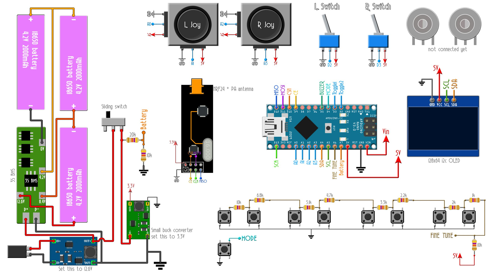
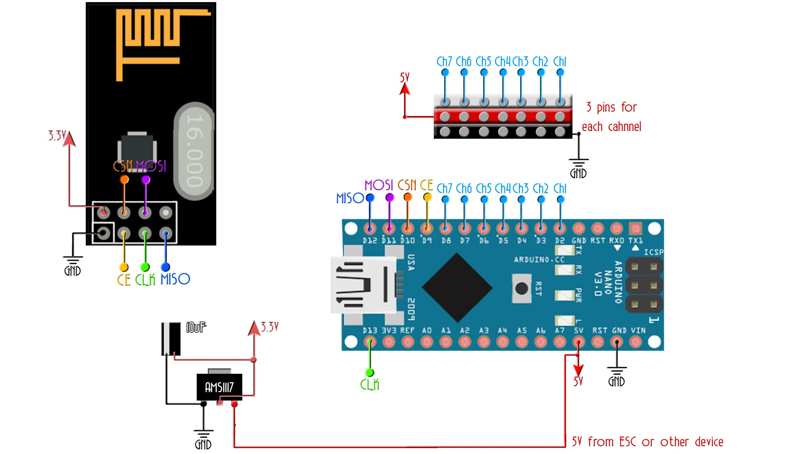

# 📡 Remote Control for Actuators using Arduino Nano & nRF24L01

<div align="center">


# 🚀 Remote Control for Actuators

### Low-Cost Long-Range Wireless Communication System

Affordable, reliable, and scalable wireless control for automation applications.

</div>

---

# 📖 Table of Contents

- 🎯 Problem Statement
- 💡 Proposed Solution
- 🔍 Project Overview
- 📸 Hardware Setup
- 🔌 Circuit Diagrams
- ✨ Features
- ⚙️ Hardware Components
- 💻 Working Principle
- 📁 Repository Structure
- 🚀 Getting Started
- 📊 Results
- 🎯 Applications
- 🔮 Future Scope
- 👨‍💻 Author

---

# 🎯 Problem Statement

Modern automation systems require actuators to be controlled remotely. Traditional wired systems suffer from several limitations:

❌ High installation cost

❌ Difficult wiring in large areas

❌ Limited flexibility

❌ Complex maintenance

❌ Expensive industrial wireless solutions

Applications such as:

- 🏭 Industrial Automation
- 🌾 Smart Agriculture
- 🏠 Home Automation
- 🚰 Remote Pump Control
- 🤖 Robotics Systems

need an affordable and reliable wireless control system capable of operating over long distances.

---

# 💡 Proposed Solution

This project presents a **Wireless Actuator Control System** using:

- Arduino Nano
- nRF24L01 Wireless Modules
- Embedded C Programming

The system creates a reliable wireless communication link between transmitter and receiver modules, enabling remote control of actuators with:

✅ Low latency communication

✅ Long-range operation

✅ Low power consumption

✅ Cost reduction of over **60%**

✅ Easy deployment and maintenance

---

# 🔍 Project Overview

The project consists of two sections.

## 📡 Transmitter Unit

- Reads user input
- Generates control packets
- Sends commands wirelessly using nRF24L01

## ⚙️ Receiver Unit

- Receives wireless packets
- Verifies received data
- Controls the connected actuator

---

# 📸 Hardware Setup

<p align="center">
  
</p>

<p align="center">
  <em>Complete Hardware Setup</em>
</p>

---

# 🔌 Circuit Diagrams

## 📡 Transmitter Circuit

<p align="center">
  
</p>

<p align="center">
  <em>Figure 1: Transmitter Circuit Diagram</em>
</p>

---

## ⚙️ Receiver Circuit

<p align="center">
  
</p>

<p align="center">
  <em>Figure 2: Receiver Circuit Diagram</em>
</p>

---

# ✨ Features

✔️ Reliable long-range wireless communication

✔️ Low implementation cost

✔️ Minimal communication delay

✔️ Modular and scalable design

✔️ Easy to replicate

✔️ Suitable for industrial and agricultural applications

✔️ Supports operation in interference-prone environments

---

# ⚙️ Hardware Components

| Component | Quantity |
|-----------|-----------|
| Arduino Nano | 2 |
| nRF24L01 Module | 2 |
| Push Buttons | 1 |
| Relay Module | 1 |
| Actuator | 1 |
| Breadboard | 1 |
| Jumper Wires | Several |
| Power Supply | 2 |

---

# 🔌 nRF24L01 Pin Connections

| nRF24L01 | Arduino Nano |
|-----------|---------------|
| VCC | 3.3V |
| GND | GND |
| CE | D9 |
| CSN | D10 |
| SCK | D13 |
| MOSI | D11 |
| MISO | D12 |

---

# 💻 Working Principle

### Step 1
The user presses the button connected to the transmitter.

### Step 2
Arduino Nano generates a control packet.

### Step 3
The nRF24L01 module transmits the packet wirelessly.

### Step 4
The receiver module receives and validates the packet.

### Step 5
The actuator is switched ON or OFF accordingly.

---

# 📡 System Architecture

```text
+--------------------+          Wireless RF          +--------------------+
|    Transmitter     | ---------------------------> |      Receiver      |
|   Arduino Nano     |                              |    Arduino Nano     |
|     nRF24L01       |                              |      nRF24L01       |
+--------------------+                              +--------------------+
                                                               |
                                                               |
                                                               V
                                                        +---------------+
                                                        |   Actuator    |
                                                        +---------------+
```

---

# 📊 Results

| Parameter | Value |
|-----------|--------|
| Communication Type | Wireless RF |
| Controller | Arduino Nano |
| Communication Module | nRF24L01 |
| Response Time | Very Low |
| Cost Reduction | >60% |
| Reliability | High |

---

# 🎯 Applications

🏭 Industrial Automation

🌾 Smart Agriculture

🏠 Home Automation

🚰 Water Pump Control

🤖 Robotics Systems

🔌 Remote Switching Systems

---

# 🔮 Future Scope

🚀 IoT Dashboard Integration

🚀 Mobile Application Control

🚀 Encrypted Communication

🚀 Multi-node Communication

🚀 Battery Monitoring

🚀 LoRa Integration

🚀 Cloud-Based Automation Platform

---

# 📁 Repository Structure

```text
Remote-Control-for-Actuators-using-Arduino-nRF24L01/
│
├── README.md
│
├── Images/
│   ├── transmitter.jpg
│   ├── receiver.jpg
│   └── Hardware/
│       └── setup.jpg
│
├── Transmitter_Code/
│   └── transmitter.ino
│
├── Receiver_Code/
│   └── receiver.ino
│
├── Documentation/
│   ├── Project_Report.pdf
│   └── Presentation.pptx
│
├── LICENSE
└── .gitignore
```

---

# 🚀 Getting Started

## Clone the Repository

```bash
git clone https://github.com/aksh0at/Remote-Control-for-Actuators-using-Arduino-nRF24L01.git
```

## Install Libraries

- RF24
- SPI

## Upload Code

- `transmitter.ino` → Transmitter Arduino Nano
- `receiver.ino` → Receiver Arduino Nano

## Connect Hardware

Connect according to the circuit diagrams above.

## Power the System

Power both Arduino boards and start controlling the actuator wirelessly.

---

# 📚 Technologies Used

- Arduino Nano
- Embedded C
- SPI Communication
- nRF24L01
- Wireless Communication

---

# 👨‍💻 Author

## Akshat Srivastava

🎓 B.Tech Electronics and Communication Engineering  
🏫 Lovely Professional University

💻 Embedded Systems | IoT | Robotics Enthusiast

🔗 GitHub: https://github.com/aksh0at

---

<div align="center">

## ⭐ If you found this project useful, please give it a star!

### 🚀 Building Affordable Wireless Automation Solutions

</div>
